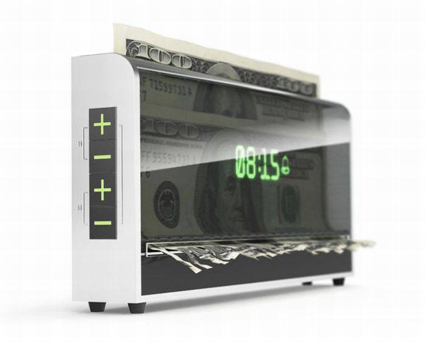

# نمونه کارهای من

## اپلیکیشن Revision

این برنامه شبیه لیست کار‌هاست که بر اساس منحنی ابینگهاوس کمک می‌کند آموخته‌های خود را به صورت فاصله‌دار مرور کنید.  
### ویژگی‌ها
1. زبان کاتلین
2. استفاده از coroutines و flow
3. استفاده از jetpack compose برای رابط کاربری
4. معماری MVVM
5. Dependency injection with Dagger Hilt
### کد منبع
 کد منبع این پروژه را می‌توانید در [این مخزن](https://github.com/amparhizgar/revision) مشاهده کنید.
### فیلم برنامه

https://user-images.githubusercontent.com/62826283/150594553-24818108-8ef4-4688-9027-aba20e3bb80b.mp4

## اپلیکیشن CryptoClock
این برنامه یک ساعت زنگ‌دار است. اما نه از نوع معمولی آن. ایدهٔ این برنامه از تصویر زیر الهام گرفته شده

برنامه دارای یک کیف پول رمزارز (BTC, LTC, Doge, Dash) است و اگر به موقع بیدار نشوید، مبلغی که خودتان مشخص کرده‌اید به عنوان جریمه از کیف پولتان کسر می‌شود.

### فیلم برنامه

https://user-images.githubusercontent.com/62826283/150594983-5e574d6d-9c0e-4741-b105-c0488873ac1d.mp4

## باورینو
این برنامه به شما امکان می‌دهد جملات قصار یا انگیزشی را به برنامه اضافه کنید و در بازه ای از روز که تعیین می‌کنید، به صورت نوتیفیکیشن دریافت کنید.  
همچنین یادداشت‌ها قابلیت به اشتراک گذاری با کاربران درون و بیرون از برنامه را دارند.  
همچنین قابلیت ساخت اکانت، و همگام‌سازی یادداشت‌ها با سرور و دستگاه‌های دیگر را داراست.
قسمت سرور این برنامه با زبان php نوشته شده است.

### فیلم برنامه

https://user-images.githubusercontent.com/62826283/150594511-c3926fa1-8e89-4c87-be3d-d27a5ad9acbf.mp4

